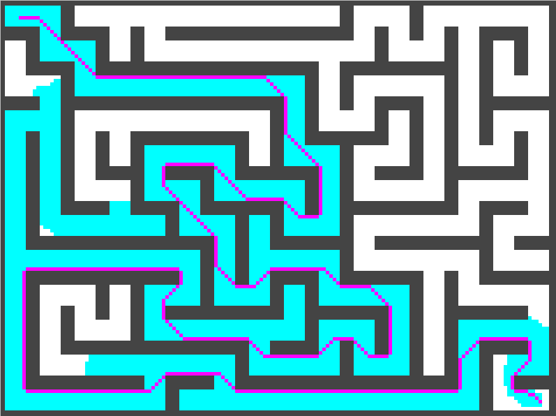

# Planning Algorithms

Planning algorithms implemented for a simple 2D grid search space.

Uses a randomly generated maze to define the occupancy map.

Currently only A* is implemented, with a solution shown below.

